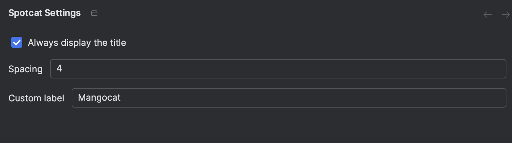

# 🥭🐱🎵 Spotcat - Spotify Controls for JetBrains IDEs

<p align="center">
  <b>Control Spotify without leaving your IDE</b>
</p>

<p align="center">
  <a href="#features">Features</a> •
  <a href="#installation">Installation</a> •
  <a href="#usage">Usage</a> •
  <a href="#development">Development</a> •
  <a href="#license">License</a>
</p>

<p align="center">
  
  
  
  
  
</p>

## 🚀 Features

> **⚠️ Important:** This plugin is compatible **ONLY with macOS** and requires the Spotify desktop application to be
> installed.
>
> Spotyy is a plugin for all JetBrains IDEs (IntelliJ IDEA, Android Studio, PyCharm, WebStorm, etc.) that lets you
> control Spotify directly from your IDE status bar:

- ▶️ Play/pause your music with one click
- ⏮️ Skip to previous track
- ⏭️ Skip to next track
- 🔊 Control volume
- 📋 View currently playing track

## 📸 Demo
status bar
<p align="center">
  
</p>
settings
<p align="center">
  
</p>
actions
<p align="center">
  
</p>

## 💿 Installation

1. Open any JetBrains IDE (IntelliJ IDEA, Android Studio, PyCharm, etc.)
2. Go to `Preferences (Settings)` > `Plugins` > `Marketplace`
3. Search for "**Spotcat**"
4. Click `Install`
5. Restart your IDE

## 📝 Requirements

- **macOS ONLY** - This plugin uses AppleScript to communicate with Spotify and is not compatible with Windows or Linux
- **Spotify desktop application** must be installed (not just the web player)
- Any JetBrains IDE (IntelliJ IDEA, Android Studio, PyCharm, WebStorm, etc.)

## 🎮 Usage

After installation, you'll see a Spotify icon in your status bar at the bottom of the IDE.

- **Click** on the icon to expand the player controls
- **Left-click** on the play/pause button to toggle playback
- Use the **volume slider** to adjust volume
- 🧩 Customize the appearance and behavior via **Settings → Spotify Plugin**
- ⚡ Use the **Action panel** `(Double Shift → spotify.*)` to quickly control playback (Play, Pause, Next, Previous)

## ⚙️ Configuration

No additional configuration is required. The plugin automatically detects your Spotify installation and connects to it
through AppleScript (macOS only).

## 🔧 Development

### Prerequisites

- Java 11 or higher
- Gradle
- IntelliJ IDEA

### Building from source

```bash
# Clone the repository
git clone https://github.com/MangoCat827/Spotcat.git

# Navigate to the project directory
cd Spotyy

# Build the plugin
./gradlew buildPlugin
```

The built plugin will be available in `build/distributions/`.

## 🤝 Contributing

Contributions are welcome! Feel free to open issues or submit pull requests.

## 📜 License

This project is based on [magneto3572/spotyy](https://github.com/magneto3572/spotyy), originally licensed under the MIT License.

Modifications, improvements, and republishing done by MangoCat827 in 2025.

## 🙏 Acknowledgements

- Original author "magneto3572"
- Spotify for their amazing music service
- JetBrains for the IntelliJ Platform SDK

---

